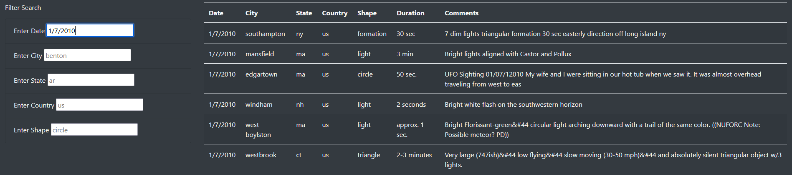
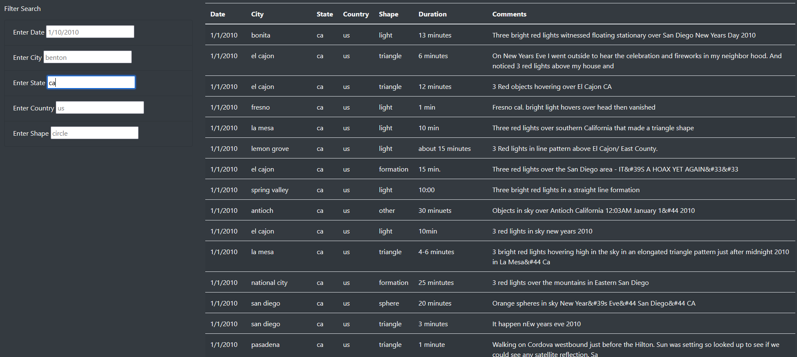
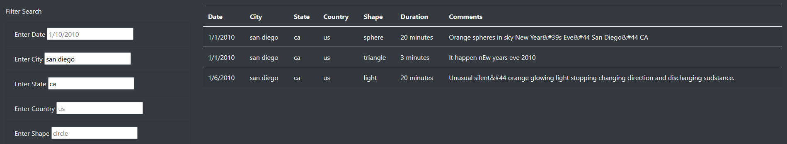

# The Truth is Out There: A Dataset for UFO Enthusiasts

## Overview of the Analysis

The purpose of this project is to create a visually appealing and user friendly way to search through a large data set documenting UFO sightings throughout the U.S. Through the search filter on this webpage, a UFO enthusiast can peruse through documented sightings based on the date, city, state, and country where the event took place as well as by the shape of the object seen.

## Results

A user can search through the data on the webpage with ease by simply typing their parameter into the appropriate search field in the format of the sample search term located in each field. No need to press a button to submit your search query, the website will return your results once you press 'enter.' 

To search for sightings on a certain date, simply type in the date you are interested in with a mm/dd/yyyy format as shown below:

To search for sightings in a certain state, simply type in the initials of the state you are interested in as shown below. Remember to submit your search in all lower case:

You can perform a search based on multiple search paramenters, as shown below:

## Summary

One draw back of this webpage is that the user does not know what search terms are available to them without perusing the list before performing the search. For instance, a user would not know which cities are included in this data set and might waste time by searching for cities that do not have documented sightings. Similarly, the user may not know the typical shapes of UFO sightings in order to be able to search for them. This could be remedied by creating dropdowns that list the dates, cities, states, and shapes of the sightings so that the user can choose from a defined list rather than guessing randomly.

The search function would also be improved if it were made case insensitive so that users can type in city, state, and shape names without worrying about capitalization. Currently the search function only accepts searches in lower case, which can be counterintuitive for a parameter such as 'state' which is usually written in upper case. 
